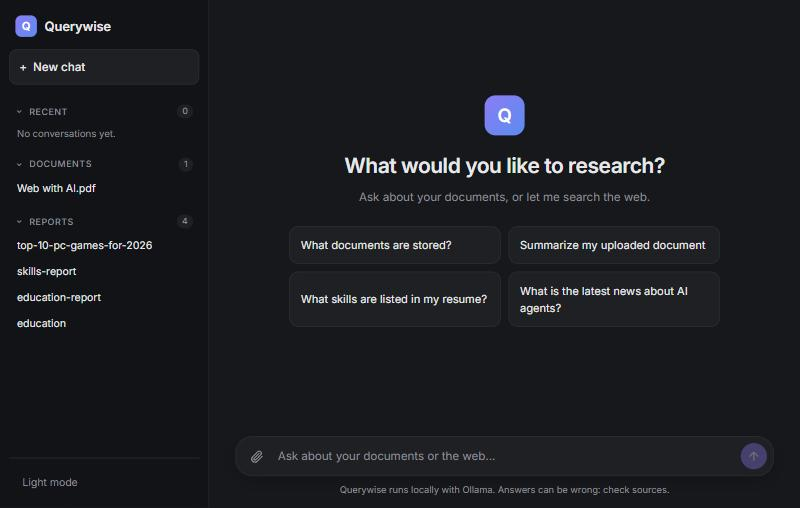
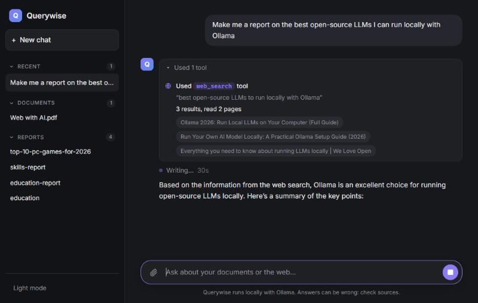
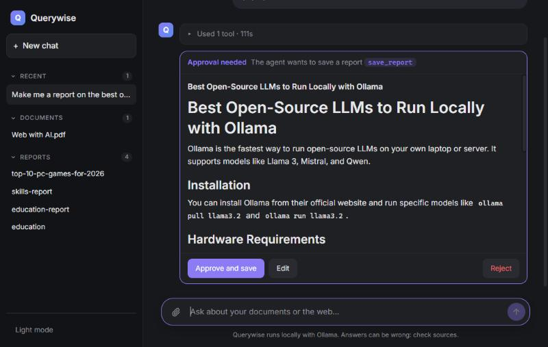
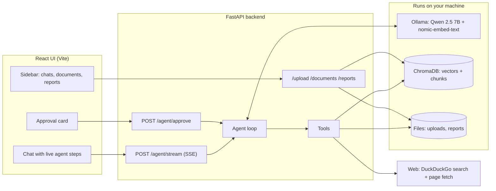
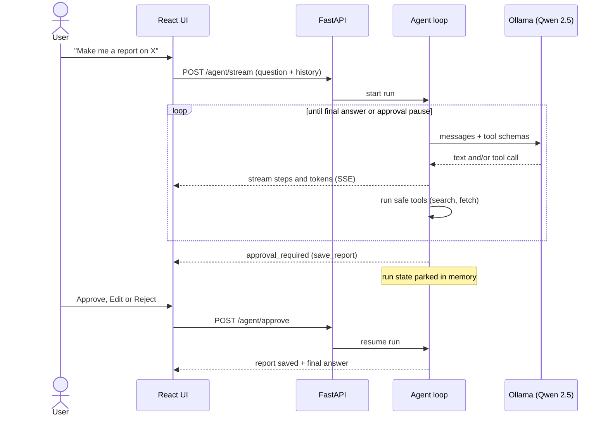

<div align="center">

# Querywise

**A local-first AI research agent. It answers from your documents and the live web, shows its work step by step, and asks for your approval before it acts.**




</div>

---

## What it is

Querywise is a full-stack **agentic RAG application**. You upload documents, ask questions in a chat, and an LLM agent decides on its own whether to search your files, search the web, read a page, or write a report. Everything the agent does is streamed to the UI live, and anything with a side effect (saving a report) pauses for a human decision.

It runs on a laptop with **no cloud LLM API**: the model, the embeddings and the vector database are all local. Your documents never leave your machine. Only web-search queries and page fetches go out to the internet.

I built it to learn how real LLM applications are put together, end to end: not just calling a model, but retrieval, tool calling, agent control flow, streaming, human-in-the-loop, and the failure modes of small models.

## Highlights

| Capability | How it works |
|---|---|
| **Grounded document Q&A (RAG)** | PDFs and text files are split along their headings, embedded locally, stored in Chroma, and retrieved by cosine similarity. Sources are shown with the answer. |
| **Autonomous tool use** | A ReAct-style loop where the model reads tool schemas and chooses between document search, web search, page fetching, listing chunks and saving reports. |
| **Live, transparent agent** | The backend streams every step over Server-Sent Events: thinking, tool call, tool result, plan, tokens. The UI shows them as they happen. |
| **Human-in-the-loop approval** | `save_report` is a gated tool. The loop pauses, parks its state, shows an approval card (approve / edit / reject), and resumes after the click. |
| **Conversation memory** | The client sends a trimmed history so follow-ups like "yes, save it" work, while staying inside a small context window. |
| **Small-model reliability tricks** | Intent detection plus a single corrective retry when the model answers in text instead of calling a tool. Tool errors are returned to the model as data. |
| **Polished chat UI** | Dark and light themes, collapsible sidebar, per-chat history, Markdown rendering, stop button, "Save as report" shortcut. |

## Screenshots

<table>
  <tr>
    <td width="50%"></td>
    <td width="50%"></td>
  </tr>
  <tr>
    <td align="center"><b>Live tool use</b><br>The agent searched the web, read two pages, and is writing the answer. Each step is visible as it happens.</td>
    <td align="center"><b>Human approval</b><br>A research report drafted from web pages. Nothing is saved until you approve, edit, or reject.</td>
  </tr>
</table>

## Architecture



### The approval flow



## The agent

The agent is a plain loop in [`backend/app/agent.py`](backend/app/agent.py), with no framework: the model is called with the conversation and the tool schemas, any tool calls are executed and fed back, and the loop repeats until the model answers or the step cap (6) is reached.

| Tool | Purpose | Gated |
|---|---|---|
| `search_documents` | Top-k vector search over the uploaded files | no |
| `list_documents` | What is stored, with chunk counts | no |
| `get_chunks` | Show the stored chunks of one document | no |
| `web_search` | DuckDuckGo / Bing search, then reads the top pages | no |
| `fetch_page` | Download one page and extract its text | no |
| `save_report` | Write a Markdown report to disk | **yes: needs approval** |

The stream emits typed events (`thinking`, `token`, `tool_call`, `tool_result`, `approval_required`, `discard_text`, `answer`) so the UI can render a live timeline instead of a spinner.

## Engineering notes

Things I measured or ran into while building it, and what I did about them.

- **A similarity threshold did not work.** On my test corpus, related questions scored 0.30 to 0.39 cosine distance and unrelated ones 0.46 to 0.53, while a vague but relevant question ("what is my name") scored 0.52. No single cut-off separates them, so I removed the threshold and let the model judge relevance from the retrieved text.
- **Fixed-size chunks cut sections in half.** A 1000-character window split headings and words. Chunking now detects headings and packs whole lines, and every chunk carries its section heading so it keeps its context.
- **Small models ask permission in text instead of calling the tool.** A 7B model often wrote the report in chat and asked "would you like to save it?". A small intent detector plus one corrective retry makes it call `save_report`, so the approval card, not the model, asks the question. The pattern was checked against 16 positive and negative phrasings.
- **Context is a budget.** Ollama's default window is 4096 tokens. History is trimmed (last 6 messages; only the newest reply stays long), and tool results are capped, so rules, history, retrieved text and the answer all fit.
- **Pause and resume without a framework.** A gated tool call stores the message history and the pending call under an id, ends the stream, and resumes from that state when `POST /agent/approve` arrives.
- **Streamed text is not always the answer.** When a model "thinks out loud" before a tool call, that text is moved into the step timeline as a plan note instead of being shown as the answer.
- **Defensive file handling.** Upload, delete and report endpoints reduce names to a bare file name, so `../` style paths cannot reach other folders.

## Limitations (honest)

- **Retrieval is plain top-2 vector search.** Broad "list everything" questions can miss a section of a document: in testing the same project question gave a correct answer once and a wrong "no projects listed" another time. Hybrid search, a reranker and query rewriting are the planned fixes.
- **No automated evaluation yet.** Quality is checked by hand. A golden question set with routing accuracy, retrieval hit rate and faithfulness scoring is the next milestone.
- **Prompt injection is not mitigated yet.** The agent reads web pages, which are untrusted text. The approval gate limits the damage, but there is no dedicated defense.
- **Approvals live in memory.** Restarting the backend while a card is pending makes that approval expire.
- **Speed.** On a CPU-only laptop a multi-step answer takes roughly 20 to 70 seconds. A GPU makes it much faster.
- **Single user, no auth.** It is designed to run locally.

## Tech stack

| Layer | Technology |
|---|---|
| LLM | Qwen 2.5 7B through [Ollama](https://ollama.com) (tool calling, streaming) |
| Embeddings | `nomic-embed-text` through Ollama |
| Vector store | ChromaDB (persistent, cosine distance) |
| Backend | Python 3.12+, FastAPI, Pydantic, `uv` |
| Document parsing | `pypdf` |
| Web access | `ddgs` (DuckDuckGo / Bing), `httpx`, BeautifulSoup |
| Frontend | React 19, Vite, `react-markdown` |
| Streaming | Server-Sent Events over `fetch` |

## Getting started

**Prerequisites:** Python 3.12+, [uv](https://docs.astral.sh/uv/), Node.js 20+, and [Ollama](https://ollama.com). About 6 GB of free RAM for the 7B model.

```bash
# 1. Pull the models (once)
ollama pull qwen2.5:7b
ollama pull nomic-embed-text

# 2. Clone
git clone https://github.com/veerverma828/AI-Assistant-Querywise.git
cd AI-Assistant-Querywise

# 3. Backend  ->  http://127.0.0.1:8000  (interactive docs at /docs)
cd backend
uv sync
uv run uvicorn app.main:app --reload
```

In a second terminal:

```bash
# 4. Frontend  ->  http://localhost:5173
cd frontend
npm install
npm run dev
```

Make sure Ollama is running, then open http://localhost:5173, attach a PDF or text file with the paperclip, and ask a question.

## Project structure

```
.
├── backend/
│   └── app/
│       ├── main.py          HTTP API: upload, agent stream, approve, reports, documents
│       ├── agent.py         Tool schemas, agent loop, history, approval pause and resume
│       ├── tools.py         Web search, page fetch, document search, report saving
│       ├── ingest.py        PDF/text parsing and heading-aware chunking
│       ├── vectorstore.py   Embeddings, Chroma storage, search, delete
│       └── rag.py           Plain RAG pipeline (the /ask baseline)
├── frontend/
│   └── src/
│       ├── App.jsx          State, chat history, agent run logic
│       ├── api.js           Backend calls and the SSE stream reader
│       └── components/      Sidebar, Composer, Message, ToolTrace, ApprovalCard
└── docs/images/             README screenshots
```

## API

| Method | Endpoint | Description |
|---|---|---|
| `POST` | `/upload` | Upload a PDF or text file, chunk and embed it |
| `GET` | `/documents` | Stored documents with chunk counts |
| `DELETE` | `/documents/{name}` | Delete a file and its chunks |
| `POST` | `/agent/stream` | Run the agent; streams events (SSE) |
| `POST` | `/agent/approve` | Approve or reject a paused action; streams the rest |
| `POST` | `/agent` | Run the agent without streaming |
| `POST` | `/ask` | Plain RAG answer with sources (no agent) |
| `GET` | `/search?q=` | Raw vector search |
| `GET` / `POST` | `/reports` | List reports / save one directly |
| `GET` / `DELETE` | `/reports/{name}` | Read or delete a report |

## Configuration

| What | Where |
|---|---|
| Agent model, step limit, history size | `AGENT_MODEL`, `MAX_STEPS`, `MAX_HISTORY_MESSAGES` in `backend/app/agent.py` |
| Embedding model, batch size | `EMBED_MODEL`, `BATCH_SIZE` in `backend/app/vectorstore.py` |
| Chunk size and overlap | `CHUNK_SIZE`, `OVERLAP_LINES` in `backend/app/ingest.py` |
| Passages sent to the model | `TOP_K` in `backend/app/tools.py` |
| Backend URL used by the UI | `API` in `frontend/src/api.js` |

## Roadmap

- [ ] Evaluation dashboard: golden question set, routing accuracy, retrieval hit rate, LLM-as-judge faithfulness, latency
- [ ] Better retrieval: hybrid search (BM25 + vectors), reranking, query rewriting
- [ ] Prompt-injection defenses for web content
- [ ] Structured answers with verified citations
- [ ] Persist runs and chats server-side (SQLite) and add tracing
- [ ] Unit tests for chunking and intent detection
- [ ] Re-implement the loop with LangGraph and compare

## Author

**Veer Verma**: [GitHub](https://github.com/veerverma828) · [LinkedIn](https://linkedin.com/in/veer-verma)
